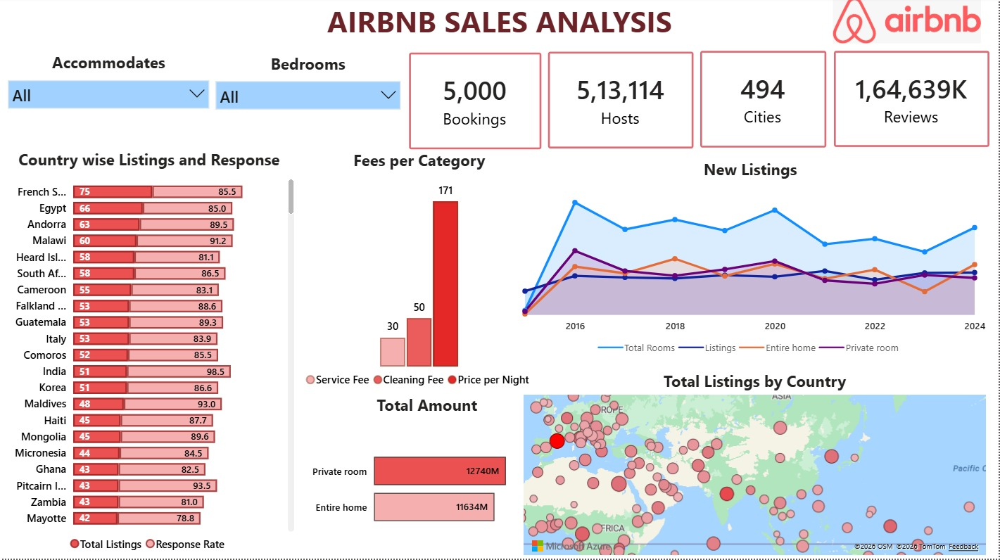

# 🏗 Airbnb End-to-End Data Analytics Project

_An end-to-end data analytics project that builds a scalable Airbnb analytics pipeline using AWS S3, Snowflake, dbt, Python, and Power BI._

---

## 📌 Table of Contents
- <a href="#overview">Overview</a>
- <a href="#architecture">Architecture</a>
- <a href="#dataset">Dataset</a>
- <a href="#tools--technologies">Tools & Technologies</a>
- <a href="#project-structure">Project Structure</a>
- <a href="#data-cleaning--preparation">Data Cleaning & Preparation</a>
- <a href="#data-modeling">Data Modeling</a>
- <a href="#key-features">Key Features</a>
- <a href="#dashboard">Dashboard</a>
- <a href="#data-quality-measures">Data Quality Measures</a>
- <a href="#conclusion">Conclusion</a>
- <a href="#author--contact">Author & Contact</a>

---
<h2><a class="anchor" id="overview"></a>Overview</h2>

- This project simulates a production-grade data engineering pipeline for Airbnb listing and booking data.
- The pipeline ingests raw CSV datasets, processes them through a Medallion architecture (Bronze → Silver → Gold) using dbt transformations, and produces analytics-ready datasets for business intelligence dashboards in Power BI.
- The project demonstrates how modern companies build scalable cloud data platforms.

---
<h2><a class="anchor" id="architecture"></a>Architecture</h2>

End-to-End Data Flow:
CSV Data
   │
   ▼
AWS S3 (Raw Storage)
   │
   ▼
Snowflake Staging Tables
   │
   ▼
Bronze Layer (Raw Data)
   │
   ▼
Silver Layer (Cleaned Data)
   │
   ▼
Gold Layer (Analytics Tables)
   │
   ▼
Power BI Dashboard

---
<h2><a class="anchor" id="dataset"></a>Dataset</h2>

- CSV file located in `/seed/` folder (airbnb_analysis)

---

<h2><a class="anchor" id="tools--technologies"></a>Tools & Technologies</h2>

- AWS S3 (Raw data storage)
- Snowflake	(Cloud Data Warehouse)
- DBT	(Data transformation & modeling)
- Python (Environment setup & scripts)
- SQL	(Data transformation queries)
- Git/GitHub (Version control)
- Power BI (Data visualization)

---
<h2><a class="anchor" id="project-structure"></a>Project Structure</h2>

```
airbnb-end-to-end-data-analytics/
│
├── README.md
├── LICENSE
├── .gitignore
├── requirements.txt
├── pyproject.toml
│
├── docs/                         # Documentation
│   ├── architecture.png
│   ├── data_model.png
│   └── project_report.md
│
├── data/                         # Raw or sample datasets
│   ├── raw/
│   │   ├── bookings.csv
│   │   ├── hosts.csv
│   │   └── listings.csv
│   │
│   └── processed/
│
├── infrastructure/               # Infrastructure setup
│   ├── snowflake_setup.sql
│   ├── iam_roles.sql
│   └── s3_bucket_setup.md
│
├── pipelines/                    # Data pipeline scripts
│   ├── ingestion/
│   │   └── upload_to_s3.py
│   │
│   ├── orchestration/
│   │   └── pipeline_runner.py
│   │
│   └── monitoring/
│       └── pipeline_logs.md
│
├── dbt_project/                  # Main DBT project
│   ├── dbt_project.yml
│   │
│   ├── models/
│   │   ├── bronze/
│   │   │   ├── bronze_bookings.sql
│   │   │   ├── bronze_hosts.sql
│   │   │   └── bronze_listings.sql
│   │   │
│   │   ├── silver/
│   │   │   ├── silver_bookings.sql
│   │   │   ├── silver_hosts.sql
│   │   │   └── silver_listings.sql
│   │   │
│   │   └── gold/
│   │       ├── fact_bookings.sql
│   │       ├── dim_hosts.sql
│   │       └── dim_listings.sql
│   │
│   ├── macros/
│   │   ├── tagging_macro.sql
│   │   ├── price_category.sql
│   │   └── utility_functions.sql
│   │
│   ├── snapshots/
│   │   ├── dim_hosts_snapshot.sql
│   │   └── dim_listings_snapshot.sql
│   │
│   ├── tests/
│   │   ├── source_tests.yml
│   │   └── schema_tests.yml
│   │
│   └── seeds/
│
├── analytics/                    # SQL analysis queries
│   ├── airbnb_kpis.sql
│   └── business_questions.sql
│
├── dashboard/                    # BI dashboards
│   ├── airbnb_sales_dashboard.pbix
│   └── dashboard_screenshot.png
│
└── notebooks/                    # Exploration notebooks
    └── exploratory_analysis.ipynb
```

---
<h2><a class="anchor" id="data-cleaning--preparation"></a>Data Cleaning & Preparation</h2>

Data transformation steps included:
### Medallion Architecture

#### 🥉 Bronze Layer (Raw Data)
Raw data ingested from staging with minimal transformations:
- `bronze_bookings` - Raw booking transactions
- `bronze_hosts` - Raw host information
- `bronze_listings` - Raw property listings

#### 🥈 Silver Layer (Cleaned Data)
Cleaned and standardized data:
- `silver_bookings` - Validated booking records
- `silver_hosts` - Enhanced host profiles with quality metrics
- `silver_listings` - Standardized listing information with price categorization

#### 🥇 Gold Layer (Analytics-Ready)
Business-ready datasets optimized for analytics:
- `obt` (One Big Table) - Denormalized fact table joining bookings, listings, and hosts
- `fact` - Fact table for dimensional modeling
- Ephemeral models for intermediate transformations

### Snapshots (SCD Type 2)
Slowly Changing Dimensions to track historical changes:
- `dim_bookings` - Historical booking changes
- `dim_hosts` - Historical host profile changes
- `dim_listings` - Historical listing changes
---
<h2><a class="anchor" id="data-modeling"></a>Data Modeling</h2>

📊 Data Modeling
The project implements a Star Schema.

Fact Tables
```bash
fact_bookings
```

Dimension Tables
```bash
dim_hosts
dim_listings
dim_locations
```
- Benefits:
  - Faster analytical queries
  - Scalable reporting
  - Simplified BI dashboards


**⚙ Data Pipeline Workflow**
1) Data Ingestion
Raw Airbnb datasets are uploaded to AWS S3 buckets.

2) Data Warehouse Loading
Snowflake loads data from S3 into staging tables.

3) Transformation Layer
dbt transforms the raw data into structured datasets.

4) Data Modeling
Fact and dimension tables are created for analytical queries.

5) Business Intelligence
Power BI connects to the Gold layer tables to create dashboards.

---
<h2><a class="anchor" id="key-features"></a>Key Features</h2>

## 🎯 Key Features

### 1. Incremental Loading
Bronze and silver models use incremental materialization to process only new/changed data:
```sql
{{ config(materialized='incremental') }}

    WHERE CREATED_AT > (SELECT COALESCE(MAX(CREATED_AT), '1900-01-01') FROM {{ this }})

```

### 2. Custom Macros
Reusable business logic:
- **`tag()` macro**: Categorizes prices into 'low', 'medium', 'high'
  ```sql
  {{ tag('CAST(PRICE_PER_NIGHT AS INT)') }} AS PRICE_PER_NIGHT_TAG
  ```

### 3. Dynamic SQL Generation
The OBT (One Big Table) model uses Jinja loops for maintainable joins:
```sql

SELECT ...
```

### 4. Slowly Changing Dimensions
Track historical changes with timestamp-based snapshots:
- Valid from/to dates automatically maintained
- Historical data preserved for point-in-time analysis

### 5. Schema Organization
Automatic schema separation by layer:
- Bronze models → `AIRBNB.BRONZE.*`
- Silver models → `AIRBNB.SILVER.*`
- Gold models → `AIRBNB.GOLD.*`


---
<h2><a class="anchor" id="dashboard"></a>Dashboard</h2>

**📊 Power BI Dashboard**
- The final analytics layer powers a Power BI dashboard that provides insights into Airbnb listings and sales performance.
 - Dashboard Metrics
   -Total Bookings
   -Total Hosts
   -Total Cities
   -Total Reviews

  - Key Visualizations
   - Country-wise Listings & Response Rate
    -Shows listing distribution across countries and host response performance.
   
   - Fees per Category
    - Breakdown of:
     -Service Fee
     -Cleaning Fee
     -Price per Night

   - -New Listings Trend
    - Time series showing:
     -Total Rooms
     -Listings
     -Entire Homes
     -Private Rooms
  
  - Total Listings by Country
   -Map visualization showing global Airbnb presence.

  - Revenue by Room Type
    - Comparison between:
     -Entire Home
     -Private Room

   - Interactive Filters
     - Users can filter data by:
       -Accommodates
       -Bedrooms

This allows deeper analysis of Airbnb market trends.




---
<h2><a class="anchor" id="data-quality-measures"></a>Data Quality Measures</h2>

## 📈 Data Quality

### Testing Strategy
- Source data validation tests
- Unique key constraints
- Not null checks
- Referential integrity tests
- Custom business rule tests

### Data Lineage
dbt automatically tracks data lineage, showing:
- Upstream dependencies
- Downstream impacts
- Model relationships
- Source to consumption flow

## 🔐 Security & Best Practices

1. **Credentials Management**
   - Never commit `profiles.yml` with credentials
   - Use environment variables for sensitive data
   - Implement role-based access control (RBAC) in Snowflake

2. **Code Quality**
   - SQL formatting with `sqlfmt`
   - Version control with Git
   - Code reviews for model changes

3. **Performance Optimization**
   - Incremental models for large datasets
   - Ephemeral models for intermediate transformations
   - Appropriate clustering keys in Snowflake

---
<h2><a class="anchor" id="conclusion"></a>Conclusion</h2>

This project demonstrates how modern data engineering tools can be combined to build a scalable, maintainable, and production-ready data pipeline.

By integrating Snowflake, dbt, and AWS, the pipeline transforms raw Airbnb data into structured, analytics-ready datasets following industry-standard data warehouse practices.

The project highlights critical skills required for Data Engineer and Analytics Engineer roles, including:
 - Data pipeline design
 - Data modeling
 - Cloud data warehousing
 - SQL transformations
 - Data quality testing
---
<h2><a class="anchor" id="author--contact"></a>Author & Contact</h2>

**Shruti Bade**    
📧 Email: shrutibade12@gmail.com  
🔗 [LinkedIn](https://www.linkedin.com/in/shruti-bade)  
